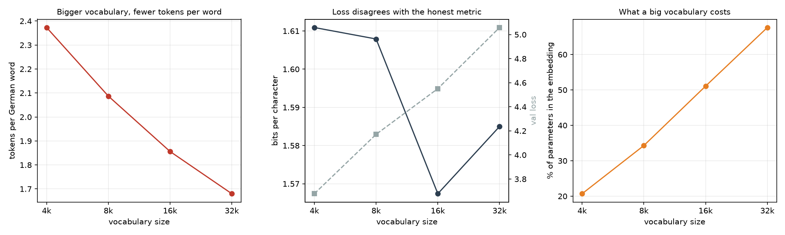
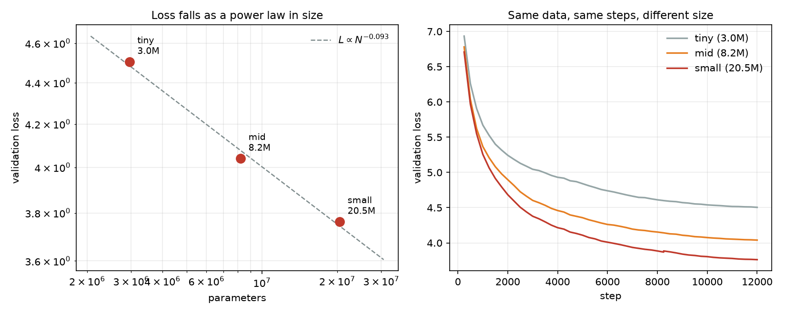

# Silbe

**A German language model trained from scratch on a MacBook Air.**

No pretrained weights, no fine-tuning, no API. Random numbers, 531 MB of German
Wikipedia, and a fanless laptop. Everything it knows about German it worked out
from text.

*Silbe* is German for **syllable** — which is what a tokenizer produces: language
cut into pieces small enough for a machine to count.

---

## The two findings

Training a small transformer is a solved exercise. These are the parts worth
reading.

### 1. Validation loss is the wrong metric for comparing tokenizers

Cross-entropy is measured **per token, over the vocabulary**. Predicting one of
4,096 options is inherently easier than one of 32,768 — so a small vocabulary
posts a lower loss while being no better at German.

Four vocabularies, identical models, identical data:

| vocab | params | embedding share | tokens/word | **val loss** | **bits/char** |
|---|---|---|---|---|---|
| 4,096 | 5.07M | 21% | 2.373 | **3.678** ← *"best"* | 1.6109 |
| 8,192 | 6.11M | 34% | 2.087 | 4.171 | 1.6079 |
| 16,384 | 8.21M | 51% | 1.856 | 4.551 | **1.5674** ← best |
| 32,768 | 12.41M | 68% | 1.680 | **5.058** ← *"worst"* | 1.5850 |

**The two metrics rank the four models in opposite orders.** Validation loss
says use 4,096 — the worst of the four. It is measuring how hard the
multiple-choice question is, not how well the model writes German.

**Bits per character** removes both distortions — nats to bits, and per
*character* rather than per token — so every model is scored on the same text
in the same unit regardless of how it chopped it up:

```
bpc = (loss_in_nats / ln 2) / characters_per_token
```

### 2. There is an optimum, and the embedding table explains it

Bits per character does not improve monotonically. **16,384 beats 32,768.**

The mechanism is the `embedding share` column. At 4k vocab, 21% of the model is
the embedding table; at 32k it is **68%** — two thirds of the parameters spent
on storing what tokens *are*, leaving a third to actually process language.

The tokenizer keeps improving the whole way: fertility falls 2.373 → 1.680, and
a 256-token context window holds **168 → 221 German words**, 31% more language
for the same compute. But the model peaks at 16k, because the tokenizer is not
the only thing those parameters have to pay for.



This matters more in German than in English. German welds words together —
`Geschwindigkeitsbegrenzung`, not "speed limit" — so where BPE cuts is a real
engineering decision with a measurable cost.

```
 1  Hauptbahnhof
    Hauptbahnhof

 2  Krankenversicherung
    Kranken · versicherung

 7  Arbeitsunfähigkeitsbescheinigung
    Arbeits · un · fähigkeit · s · be · schein · igung

14  Rindfleischetikettierungsüberwachungsaufgabenübertragungsgesetz
    R · ind · fl · eisch · etik · ett · ierungs · über · wach ·
    ungs · aufgaben · über · tragungs · gesetz
```

`Hauptbahnhof` survived as a single token — frequent enough in 531 MB of German
to earn its own vocabulary slot. Nobody specified that.

---

## Scaling

Three models, identical in every respect except width and depth. Same corpus,
same 256-token context, same batch size, same 12,000 steps, same 98M tokens.

| model | params | layers | heads | width | val loss | perplexity |
|---|---|---|---|---|---|---|
| tiny | 2.95M | 4 | 4 | 128 | 4.5045 | 90.4 |
| mid | 8.21M | 5 | 4 | 256 | 4.0396 | 56.8 |
| small | 20.45M | 8 | 8 | 384 | 3.7623 | 43.0 |

Fitting `log L` against `log N` gives an exponent of **0.0933**.
[Kaplan et al. (2020)](https://arxiv.org/abs/2001.08361) report ≈0.076 for
parameters.



**Being honest about that agreement: it is closer than three points deserve.**
The fit is weak, and these models are undertrained relative to their size — 98M
tokens is well short of compute-optimal. The claim is that the *shape* appears
at all, from scratch, at a scale that fits on a laptop.

The diminishing returns are visible without any fitting: 2.78× the parameters
bought 0.465 of loss, then 2.49× more bought only 0.277.

Learning rate is scaled by `1/√width` across the three, the usual heuristic.
Holding it fixed would handicap the narrow models and show up as a scaling
effect that is really a tuning artefact.

---

## What it writes

The 20M model, after roughly two hours of training:

> **Die Deutsche Bahn** AG in der Nacht vom 24. zum 22. April 2012 als
> Bundesbahntriebwagen des Deutschen Bahnbundes (WVB) in die deutsche
> Hauptverkehrsgesellschaft (GDI) aufgenommen, die von der DB Regio AG
> betrieben wird.

> **Berlin ist** eine der besten, die auch in den Bereichen Kultur, Politik und
> Musik aufgezeichnet wird.

**The content is nonsense. The German is not.** What holds up:

- **Case agreement** through nested phrases — `in die deutsche
  Hauptverkehrsgesellschaft`, accusative after `in`, adjective ending to match
- **Relative clauses** with the verb correctly at the end — `die von der DB
  Regio AG betrieben wird`
- **Passive voice**, correctly formed
- **Compound nouns it invented** — `Bundesbahntriebwagen` is not a word, but it
  is correctly built from real German morphemes
- **Register** — `ist Sitz des`, parenthetical abbreviations, date formats. It
  learned not just the language but the genre it read

Size is audible. Same prompt, three models:

| model | output |
|---|---|
| tiny 2.95M | grammatical, endlessly subordinate, never arrives |
| mid 8.21M | sentences end, with purpose clauses |
| small 20.45M | writes like an encyclopedia entry |

**It is not a chatbot and cannot become one.** At 20M parameters there is no
capacity for facts, reasoning or instruction-following. Asked a question it
produces plausible German that answers nothing. That is the correct outcome for
this size, not a failure.

---

## Architecture

Decoder-only transformer — the GPT/Llama/Mistral family, scaled down by three
orders of magnitude. Deliberately the standard arrangement: the goal is to
understand what everyone else builds, not to invent a variant.

| | |
|---|---|
| **Attention** | causal (masked) multi-head self-attention |
| **Positions** | RoPE — rotary embeddings, applied to queries and keys only |
| **Normalisation** | RMSNorm, pre-norm |
| **Feed-forward** | SwiGLU, hidden width `8/3 × d_model` |
| **Output** | weight tying — the embedding is reused as the output projection |
| **Optimiser** | AdamW, β = (0.9, 0.95), weight decay 0.1 |
| **Schedule** | linear warmup → cosine decay to 10% |
| **Stability** | gradient clipping at 1.0 |
| **Framework** | MLX on Apple Silicon (Metal) |

**Weight tying matters more at this scale than any other.** Reusing the
embedding as the output projection saves `vocab × d_model` — at 16k vocab and
384 width that is 6.3M parameters, nearly a third of the model, otherwise spent
twice on the same information.

---

## Pipeline

Five stages, each writing a file the next reads, so a mistake late never costs
the work done early.

```
1. GET TEXT   German Wikipedia (CC BY-SA) → 531 MB cleaned prose
2. TOKENIZE   byte-level BPE → 16,384 pieces
3. ENCODE     → 126.9M token IDs, flat uint16, memory-mapped
4. TRAIN      12,000 steps, checkpoint every 500
5. GENERATE   temperature / top-k / top-p / repetition penalty
```

**Wikipedia is used as a language sample, not a source of facts.** The model
learns morphology, syntax and register; whether any article is factually
correct is irrelevant to what is being extracted. A false sentence teaches the
same grammar as a true one.

**Two filters**, both about what teaches German well: articles under 600
characters are stubs and disambiguation pages; articles where over half the
lines are short are lists, not prose. 29,870 kept, 10,130 dropped.

**The train/validation split is by position, not random.** Articles are
contiguous, so a shuffled split would put one half of an article in training and
the other in validation, and the model would score well for the wrong reason.

---

## Running it

Apple Silicon required — MLX targets Metal.

```bash
uv venv --python 3.12 && uv pip install mlx numpy tokenizers pyarrow tqdm requests matplotlib

python data/prepare.py --target-mb 500          # ~5 min
python tokenizer/train.py --vocab-size 16384    # ~25 s
python data/encode.py                           # ~3 min
python train.py --config configs/small.json     # ~2 h
python generate.py --prompt "Berlin ist"
```

Model size lives entirely in configuration — five numbers separate `tiny` from
`small`. Nothing structural changes, so the same code would run unchanged on a
rented GPU.

```bash
python eval/scaling.py            # the scaling curve
python eval/tokenizer_study.py    # the vocabulary study
```

Training resumes automatically from the last checkpoint. On a fanless machine
that is not a convenience — thermal throttling, a closed lid and a full
overnight run do not coexist otherwise.

---

## What went wrong, and what it cost

**A checkpoint that cannot resume the schedule is not a checkpoint.** Resuming
restored the weights but created a fresh optimiser, whose step counter drives
the learning-rate schedule. A run resumed at step 8,000 of 12,000 would have
finished at `4.73e-04` instead of `6.00e-05` — **7.9× too high, never
annealed**, producing a model worse than the checkpoint it started from.

Caught because the training loop prints the learning rate every ten steps, and
it was going *up*. Optimiser state is now saved alongside the weights.

**Two trainers in 16 GB is one trainer.** An orphaned process and a chain script
that assumed processes either run or exit cleanly put swap at 15.2 of 16 GB. The
machine spent five hours thrashing the SSD; the second run managed 120 steps in
that time. The chain script was deleted rather than repaired — `python train.py
A && python train.py B` lets the shell guarantee what the script was polling
for.

**Measured, not assumed.** `small` is 20.45M parameters, not the 15M the design
document estimated. `base` was configured at 12 heads across 512 dimensions,
which does not divide — caught by a config assertion before any training ran.

---

## Honest limits

- **20M parameters cannot hold facts.** Every proper noun and date it produces
  should be assumed invented.
- **Undertrained.** 98M tokens against 20M parameters is well short of
  compute-optimal. More data would help more than more parameters.
- **Three points is a weak scaling fit.** The exponent agrees with published
  values more closely than the evidence supports.
- **The tokenizer study trains 4,000 steps per vocabulary**, not to convergence.
  It compares vocabularies fairly against each other; it does not establish
  absolute quality.
- **No instruction tuning, no RLHF, no quantisation, no KV cache.** Generation
  is a full forward pass per token.

---

## Concepts, if you are looking for them

Transformer · decoder-only · causal self-attention · multi-head attention ·
RoPE · RMSNorm · pre-normalisation · SwiGLU · residual connections · weight
tying · byte-pair encoding · subword tokenization · vocabulary size · fertility
· cross-entropy · perplexity · bits per character · AdamW · learning-rate
warmup · cosine decay · gradient clipping · overfitting · train/validation split
· scaling laws · compute-optimal training · checkpointing · memory-mapped I/O ·
MLX · Apple Silicon · Metal · German NLP · morphology · compound nouns

---

Built by [Abbas Aamir](https://www.linkedin.com/in/abbas-aamir-474969353/) —
CS undergraduate in Berlin.
